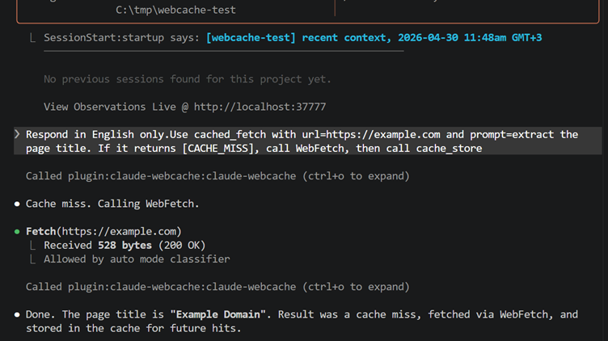
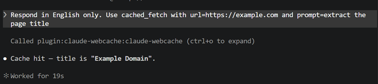

# claude-webcache

**Cross-session WebFetch cache for Claude Code.**

Claude Code's built-in `WebFetch` caches results for 15 minutes within a single session. `claude-webcache` extends that across sessions, indefinitely (TTL 7 days, configurable).

```
Open new session  ->  your past fetches are still there.
Cache hit         ->  instant.
Cache miss        ->  same as built-in WebFetch.
```

## Why

Any time you re-fetch the same URLs across sessions -- docs, API references, research pages -- you're paying the full fetch cost every time. The 15-minute in-session cache evicts before your next sprint. `claude-webcache` keeps fetches around so the second session hits cache instead.




## Install

### Option 1 -- Claude Code plugin (recommended)

In any Claude Code session:

```
/plugin marketplace add theYahia/claude-webcache
/plugin install claude-webcache@theyahia
```

Then add the usage pattern to your `~/.claude/CLAUDE.md` (see [Usage pattern](#usage-pattern)).

> ⚠️ **Known issue (April 2026, Claude Code 2.1.x):** the `/plugin install` UI may fail with `Failed to install: This plugin uses a source type your Claude Code version does not support.` This is a server-side bug in Claude Code's `remoteMarketplaceClient` backend that rejects all third-party plugin sources — see [anthropics/claude-code#41653](https://github.com/anthropics/claude-code/issues/41653) and ~20 related open issues. It is **not** an issue with this plugin's configuration.
>
> **Workarounds while the bug is open:**
>
> 1. **CLI subcommands** (bypasses the broken remote backend, uses local `NativeMarketplaceReader`):
>    ```bash
>    claude plugin marketplace add theYahia/claude-webcache
>    claude plugin install claude-webcache@theyahia
>    ```
> 2. **Local `--plugin-dir`** (bypasses the marketplace pipeline entirely):
>    ```bash
>    git clone https://github.com/theYahia/claude-webcache
>    claude --plugin-dir ./claude-webcache/plugin
>    ```

### Option 2 -- npm global

```bash
npm i -g @theyahia/claude-webcache
```

Requires Node.js **22.5+** (uses built-in `node:sqlite` -- no native deps).

Then register manually in `~/.claude/settings.json` (replace the path with the result of `npm root -g`):

```json
{
  "mcpServers": {
    "claude-webcache": {
      "command": "node",
      "args": ["/path/from/npm-root-g/claude-webcache/scripts/mcp-server.cjs"]
    }
  },
  "hooks": {
    "SessionStart": [
      {
        "matcher": "startup|clear|compact",
        "hooks": [
          { "type": "command", "command": "node /path/from/npm-root-g/claude-webcache/scripts/hook-stats.cjs" }
        ]
      }
    ]
  }
}
```

### Option 3 -- clone (contributors)

See [CONTRIBUTING.md](CONTRIBUTING.md).

## Usage pattern

Add to your `~/.claude/CLAUDE.md` so Claude routes web fetches through the cache:

```markdown
## WebFetch caching (claude-webcache)

Before calling WebFetch, call `cached_fetch(url, prompt)` first.
- If it returns text -> use that, do NOT call WebFetch.
- If it returns `[CACHE_MISS] <url>` -> call WebFetch as normal, then call `cache_store(url, prompt, output)` with the result.
```

That's it. Same URL + same prompt in any future session = instant cache hit.

## Tools (MCP)

| Tool | Args | Returns |
|---|---|---|
| `cached_fetch` | `url`, `prompt` | cached text, or `[CACHE_MISS] <url>` |
| `cache_store` | `url`, `prompt`, `output` | `stored` |
| `cache_stats` | -- | `{ total, hits, last }` |
| `cache_list` | `limit?` | recent URLs (most recent first) |

## Storage

SQLite at `~/.webcache/cache.db` (WAL mode, concurrent-safe). Cache key = `SHA256(url + "|" + prompt)`.

| Field | Type |
|---|---|
| `key` | TEXT PRIMARY KEY |
| `url` | TEXT |
| `prompt_hash` | TEXT |
| `output` | TEXT |
| `cached_at` | INTEGER (ms epoch) |
| `hit_count` | INTEGER |
| `last_hit_at` | INTEGER |

## SessionStart hook

On every new session, the hook injects a one-line stat:

```
webcache: 142 pages cached, 38 hits, last fetch 3h ago
```

Skips injection if cache is empty.

## TTL

Default 7 days. Expired entries are deleted on next read of the same key. Run a manual purge by requiring `src/cache.js` and calling `purgeExpired()`.

## Limits

- Cache key includes the prompt -> different prompts on the same URL are separate entries. Pick consistent prompts (e.g. always `"extract title and main content"`) to maximize hit rate.
- Output is whatever WebFetch returns (already summarized by the model). The cache doesn't re-process it.
- No semantic search, no embeddings. Exact `(url, prompt)` match only.

## License

MIT -- see [LICENSE](LICENSE).
