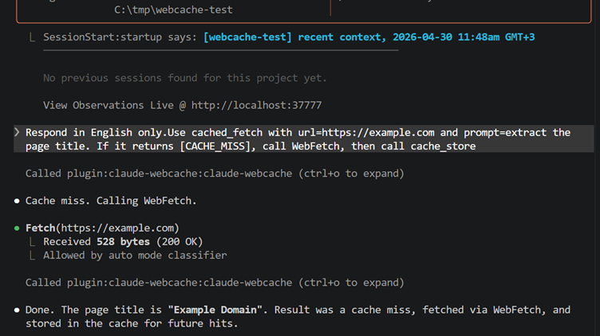
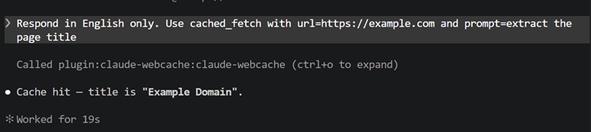

# claude-webcache


**Persistent cross-session WebFetch cache for Claude Code. Cached reads in ~0.07ms — orders of magnitude faster than re-fetching.**

Claude Code's built-in cache lasts 15 minutes, within one session. Every new session re-fetches from scratch. `claude-webcache` persists results across sessions in a local SQLite database — instant cache hits, zero network cost.

```
Session 1  →  WebFetch("docs.example.com")  →  fetched, auto-cached ✓
Session 2  →  cached_fetch("docs.example.com")  →  instant hit, no network call
Session 7  →  cached_fetch("docs.example.com")  →  still instant, unlimited TTL
```

**v0.1.5+:** every `WebFetch` is automatically saved via `PostToolUse` hook — nothing to configure.




## Install

```bash
claude plugin marketplace add theYahia/claude-webcache && claude plugin install claude-webcache@theyahia
```

Works in: **Claude Code CLI · Desktop (Mac/Windows) · VS Code extension · JetBrains plugin** — same command everywhere.

Done. Every `WebFetch` is auto-cached from now on.

Optionally add the [usage pattern](#usage-pattern) to `~/.claude/CLAUDE.md` to also check the cache *before* fetching (saves the WebFetch call entirely on repeat URLs).

> **Plugin TUI not working?** There's an open Claude Code bug ([#41653](https://github.com/anthropics/claude-code/issues/41653)) where `/plugin install` rejects third-party sources with "source type not supported." Use the CLI command above — it bypasses the TUI and works fine.
>
> **Fallback (no marketplace):**
> ```bash
> git clone https://github.com/theYahia/claude-webcache && claude --plugin-dir ./claude-webcache/plugin
> ```

### Option 2 — npm global

```bash
npm i -g @theyahia/claude-webcache
```

Requires Node.js **22.5+** (uses built-in `node:sqlite` — no native deps, no install step).

Then register in `~/.claude/settings.json` (replace path with output of `npm root -g`):

```json
{
  "mcpServers": {
    "claude-webcache": {
      "command": "node",
      "args": ["/path/from/npm-root-g/claude-webcache/scripts/mcp-server.cjs"]
    }
  },
  "hooks": {
    "SessionStart": [
      {
        "matcher": "startup|clear|compact",
        "hooks": [
          { "type": "command", "command": "node /path/from/npm-root-g/claude-webcache/scripts/hook-stats.cjs" }
        ]
      }
    ]
  }
}
```

### Option 3 — clone (contributors)

See [CONTRIBUTING.md](CONTRIBUTING.md).

## Usage pattern (optional — for pre-fetch cache checks)

**v0.1.5+ auto-caches every WebFetch automatically.** The pattern below is optional: add it to `~/.claude/CLAUDE.md` to also check the cache *before* making a WebFetch — this saves the WebFetch call entirely on repeat URLs.

**Auto-read (v0.5+): nothing to do.** A `PreToolUse` hook checks the cache before every `WebFetch`/`WebSearch`. On a hit it serves the cached copy and skips the network; on a miss the call runs normally and the `PostToolUse` hook stores the result. Same URL + same prompt (or same search query) in any future session = instant hit, zero network cost.

Manual lookup is still available if you want it: call `cached_fetch(url, prompt)` (or `cached_search(query)`) — returns the cached text, or `[CACHE_MISS] …` if absent. Disable auto-read with `WEBCACHE_AUTOREAD=0`.

## ⚠ Security — authenticated URLs

The cache stores the URL alongside the response in `~/.webcache/cache.db`. **By default, claude-webcache strips obvious credentials from the stored URL** before write (`user:pass@host` and query params named `token`, `api_key`, `apikey`, `access_token`, `auth`, `secret`, `password`, `key`, `signature`, etc.).

**That's display-level redaction, not key-level.** The cache key still hashes the original URL, so re-fetching the same authenticated URL hits the cache. If you want a stricter trade-off:

```bash
export WEBCACHE_STRICT_REDACT=1
```

With `WEBCACHE_STRICT_REDACT=1`, the cache key is computed from the redacted URL too — endpoints differing only in `?token=A` vs `?token=B` collide in one slot. Safe for pass-through auth (identical content), **unsafe for personalized endpoints** (different users see each other's cached data).

**Bottom line:** prefer header-based auth (`Authorization:` headers) over URL-embedded tokens. Don't commit `~/.webcache/cache.db` to git.

## Namespaces

Multiple projects sharing one machine? Isolate per-project caches:

```bash
WEBCACHE_NAMESPACE=gosdelo  claude    # cache writes/reads scoped to ns "gosdelo"
WEBCACHE_NAMESPACE=qsearch  claude    # separate ns, no cross-contamination
```

Default namespace is the empty string `""` (shared cache for v0.3 behavior). Inspect/manage per-namespace via CLI: `claude-webcache namespaces`, `claude-webcache --namespace gosdelo stats`.

## Tools (MCP)

| Tool | Args | Returns |
|---|---|---|
| `cached_fetch` | `url`, `prompt` | cached text, or `[CACHE_MISS] <url>` |
| `cached_search` | `query` | cached WebSearch results, or `[CACHE_MISS] <query>` (websearch namespace, short TTL) |
| `cache_store` | `url`, `prompt`, `output` | `stored` |
| `cache_stats` | `global?` | `{ namespace, total, hits, misses, hit_rate, last, db_size_bytes, evicted, oversize_skipped, last_hook_error_at, top_urls, ... }` |
| `cache_list` | `limit?`, `offset?`, `global?` | recent URLs (most recent first) |
| `cache_invalidate` | `url` | `{ deleted: N }` — drops every entry for that URL in current namespace |
| `cache_clear` | `older_than_days?`, `confirm?` | `{ deleted: N }` — partial wipe by age, or full wipe with `confirm:"YES"` |
| `cache_warm` | `entries: [{url,prompt}]` or `urls[]+prompt` | `{ hits, misses, invalid }` — bulk pre-flight in one call |
| `cache_refresh` | `url`, `prompt` | `[CACHE_MISS] <url>` — invalidates and signals re-fetch |

## CLI

The npm package ships a `claude-webcache` binary for ad-hoc inspection and a local web dashboard:

```bash
claude-webcache stats                            # JSON stats
claude-webcache stats --by-domain                # per-domain breakdown
claude-webcache list 20                          # 20 most-recent URLs
claude-webcache list 50 --offset 100             # pagination
claude-webcache invalidate https://news.com/123  # drop one URL
claude-webcache refresh https://news.com/123 --prompt "extract title"   # invalidate one (url,prompt) pair
claude-webcache warm urls.txt --prompt "extract" # bulk pre-flight check
claude-webcache clear --older-than-days 30       # partial wipe
claude-webcache clear --confirm YES              # full wipe (requires explicit confirm)
claude-webcache clear-logs                       # truncate ~/.webcache/hook.log
claude-webcache namespaces                       # list all namespaces present
claude-webcache export --out cache.json --all    # export metadata
claude-webcache dashboard                        # open http://localhost:37778
claude-webcache --namespace gosdelo stats        # scope command to namespace
```

The dashboard renders top URLs by hits, top domains (with avg hits / last fetch / entry counts), full search-able paginated list with one-click invalidate + refresh buttons. Pure stdlib — no extra deps to install.

## Configuration (env vars)

| Variable | Default | Effect |
|---|---|---|
| `WEBCACHE_TTL_DAYS` | unlimited | Global TTL in days. `0` or unset = unlimited. |
| `WEBCACHE_MAX_SIZE_MB` | unlimited | Above this size, LRU eviction drops ~20% of oldest-by-`last_hit_at` entries on next write (debounced every 100 writes). |
| `WEBCACHE_DOMAIN_TTL` | none | Per-domain TTL JSON: `{"news.com":1,"reuters.com":1,"arxiv.org":0}`. Days; `0` = unlimited. Suffix-matches subdomains. Overrides global TTL when matched. |
| `WEBCACHE_NAMESPACE` | `""` (shared) | Isolate the cache per project. Different namespaces never see each other's entries. |
| `WEBCACHE_MAX_OUTPUT_MB` | 10 | Reject WebFetch responses larger than N MB. Stats track `oversize_skipped` counter and `last_oversize_url`. |
| `WEBCACHE_COMPRESS` | off | `1` enables gzip on responses ≥4 KB. Stored as base64 in TEXT column. Existing uncompressed rows read fine (BC). |
| `WEBCACHE_STRICT_REDACT` | off | `1` makes the cache key use the redacted URL — collides per endpoint regardless of token value. See Security above. |
| `WEBCACHE_QUIET` | off | `1` suppresses hook stderr output (file log at `~/.webcache/hook.log` still written). |
| `WEBCACHE_DEBUG` | off | `1` enables verbose tracing in the auto-cache hook. |
| `WEBCACHE_SEARCH_TTL_HOURS` | 6 | TTL for cached `WebSearch` results (the `websearch` namespace). Search rankings drift, so this is short by default. `0` = never expire. |
| `WEBCACHE_AUTOREAD` | on | `0` disables the `PreToolUse` auto-read hooks (cache still fills via `PostToolUse`; you read it manually via `cached_fetch`/`cached_search`). |

## SessionStart hook

Every new session injects a one-liner so Claude knows the cache exists:

```
webcache [ns=gosdelo] 142 pages cached, 87% hit rate, last fetch 3h ago
```

No output if cache is empty. `[ns=...]` is omitted when using the default namespace.

## Storage

SQLite at `~/.webcache/cache.db` (WAL mode, `synchronous=NORMAL`, `busy_timeout=5000`).
Cache key = `SHA256(namespace + "|" + canonical(url) + "|" + prompt)`. Default TTL: **unlimited** (set `WEBCACHE_TTL_DAYS=N` for N-day expiry).

**URL canonicalization** (v0.4+): lowercase hostname, strip default ports (`:80`/`:443`), strip fragment, sort query parameters alphabetically. So `https://EXAMPLE.com/p?b=2&a=1#frag` and `https://example.com/p?a=1&b=2` produce the same cache key — no silent miss on URL formatting variance.

| Field | Type |
|---|---|
| `key` | TEXT PRIMARY KEY |
| `url` | TEXT (redacted) |
| `prompt_hash` | TEXT |
| `output` | TEXT (gzip+base64 when compressed=1) |
| `cached_at` | INTEGER (ms epoch) |
| `hit_count` | INTEGER |
| `last_hit_at` | INTEGER |
| `namespace` | TEXT (default `""`) |
| `compressed` | INTEGER (0/1) |

Concurrent-safe via WAL + 5-second `busy_timeout` — multiple Claude Code sessions can read/write simultaneously without `SQLITE_BUSY` errors.

## Limits

- Cache key includes the prompt — use consistent prompts to maximize hit rate.
- Output is whatever WebFetch returns (already summarized). No re-processing.
- No semantic search. Exact `(namespace, canonical_url, prompt)` match only.

## Benchmarks

Single-process latency on a populated DB (N=10000 entries, 1KB output each), measured via `npm run bench`:

| Op | p50 | p95 | p99 | ops/sec |
|---:|---:|---:|---:|---:|
| `write` | 0.09ms | 0.15ms | 2.66ms | 5,800 |
| `read_hit` | 0.07ms | 0.12ms | 0.23ms | 7,600 |
| `read_miss` | 0.04ms | 0.07ms | 0.13ms | 17,600 |
| `list_50` | 0.11ms | 0.16ms | 0.53ms | 7,400 |

Storage overhead: ~2 KB per entry for a 1 KB payload (key + indexes + WAL + new v0.4 columns). With `WEBCACHE_COMPRESS=1` on text-heavy responses, expect 3-7× reduction.

WebFetch over the network typically takes 1-5 seconds — a cached hit is **~15,000-70,000× faster**. Reproduce on your hardware: `npm run bench`. See [`bench/README.md`](bench/README.md) for methodology and full results metadata (CPU, RAM, OS, commit) saved per run.

## How this differs from Anthropic prompt caching

Anthropic's [prompt caching](https://docs.anthropic.com/en/docs/build-with-claude/prompt-caching) caches prompt-prefix tokens server-side with a 5-minute (or 1-hour) TTL. `claude-webcache` caches WebFetch tool outputs locally in SQLite with no expiry by default. Different layers — they compose, not compete:

| | Anthropic prompt cache | claude-webcache |
|---|---|---|
| What's cached | Input prompt tokens (tools + system + messages prefix) | WebFetch output text |
| Where it lives | Anthropic servers | Local `~/.webcache/cache.db` |
| Lifetime | 5 minutes (or 1 hour) | Unlimited by default |
| Cross-session | No — resets ~hourly at most | Yes — survives restarts, survives weeks |
| Triggers on | Same prompt prefix repeats within TTL | Same `(url, prompt)` ever repeats |
| What it saves | LLM input token billing (cache reads = 0.1× base price) | The WebFetch network round-trip itself |

A cached WebFetch hit returns the exact same bytes every time. Those bytes can then participate in Anthropic's prompt cache normally on the next API call within the same session — the two caches stack: webcache skips the fetch entirely, Anthropic's cache discounts the read of the resulting `tool_result` block.

For Claude Code subscription users (flat-rate, not metered per token), Anthropic prompt caching is mostly invisible to your bill — but `claude-webcache` still saves real wall-clock time and message-turn budget by avoiding the WebFetch round-trip and the inference round needed to summarize the page.

## Related

- [claude-mem](https://github.com/thedotmack/claude-mem) — persistent memory across sessions (complements claude-webcache: memory vs. web cache)
- [WWmcp](https://github.com/theYahia/WWmcp) — catalog of 120+ MCP servers for non-Western APIs

## License

MIT — see [LICENSE](LICENSE).
